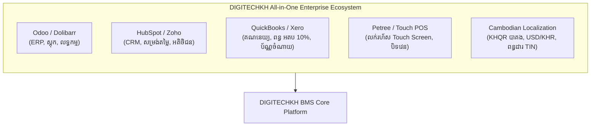

# DIGITECHKH Business Management System (BMS)
## ឯកសារស្ថាបត្យកម្ម និងទិដ្ឋភាពទូទៅនៃប្រព័ន្ធកម្រិតសហគ្រាស (System Architecture & Master Overview)

- **កំណែប្រែ (Version)**: 1.0 (Enterprise Delivery Baseline)
- **កាលបរិច្ឆេទ (Date)**: 17 កញ្ញា 2026
- **ស្ថានភាព (Status)**: ឯកសារផ្លូវការសម្រាប់ណែនាំ និងផ្ទៀងផ្ទាត់ប្រព័ន្ធ (Approved Baseline)
- **ក្រុមហ៊ុនអភិវឌ្ឍន៍**: DIGITECHKH Co., Ltd.

---

## 1. បេសកកម្ម និងគោលបំណងនៃប្រព័ន្ធ (System Mission & Purpose)

**DIGITECHKH BMS** គឺជាប្រព័ន្ធគ្រប់គ្រងអាជីវកម្មកម្រិតសហគ្រាសរួមបញ្ចូលគ្នា (**All-in-One Enterprise Business Management System**) ដែលត្រូវបានរចនាឡើងជាពិសេសដើម្បីដោះស្រាយបញ្ហាស្មុគស្មាញនៃអាជីវកម្មសម័យទំនើប ដោយរួមបញ្ចូលគ្នានូវចំណុចខ្លាំងបំផុតនៃប្រព័ន្ធលំដាប់ពិភពលោក (ដូចជា Odoo, HubSpot, QuickBooks, Petree POS) ជាមួយការបន្ស៊ាំស្របតាមបរិបទអាជីវកម្ម និងច្បាប់នៃព្រះរាជាណាចក្រកម្ពុជា (Cambodian Localization)។

ប្រព័ន្ធនេះត្រូវបានរចនាឡើងសម្រាប់សហគ្រិន និងស្ថាបត្យករប្រព័ន្ធដែលទើបបង្កើតប្រព័ន្ធធំលើកដំបូង ដោយផ្តល់នូវរចនាសម្ព័ន្ធរឹងមាំ ងាយស្រួលយល់ និងការពារកំហុសឆ្គងពីកម្រិតគ្រឹះ។

---

## 2. សមាសភាគសំខាន់ៗដែលត្រូវបានរួមបញ្ចូល (Integrated Capabilities)

| ល.រ | មុខងារស្នូល (Core Feature) | គំរូប្រព័ន្ធពិភពលោក (Inspiration) | ការអនុវត្តជាក់ស្តែងក្នុង DIGITECHKH BMS |
|---|---|---|---|
| **1** | **គ្រប់គ្រងសង្វាក់លក់ (Sales & CRM)** | HubSpot / Odoo CRM | សម្រង់តម្លៃ (Quote) → វិក្កយបត្រ (Invoice) → តម្លៃឌីណាមិកតាមកម្រិតអតិថិជន (រាយ, ដុំ, VIP) → ប័ណ្ណដឹកជញ្ជូន |
| **2** | **គ្រប់គ្រងស្តុកទំនិញ (Inventory/MRP)** | Odoo Inventory / Dolibarr | តុល្យភាពស្តុកតាមឃ្លាំង, ចលនាផ្ទេរទំនិញ, កាតាឡុក SKU, ការរាប់ស្តុកជាក់ស្តែង, **ដកចេញតម្លៃលក់/ថ្លៃដើម 100% សម្រាប់បុគ្គលិកស្តុក** |
| **3** | **គ្រប់គ្រងលទ្ធកម្ម (Purchasing)** | SAP Business One / Odoo | បញ្ជាទិញចូល (PO), គ្រប់គ្រងអ្នកផ្គត់ផ្គង់, ផ្ទៀងផ្ទាត់វិក្កយបត្រទិញ, គណនាថ្លៃដើមមធ្យម |
| **4** | **គណនេយ្យ និងហិរញ្ញវត្ថុ (Accounting)** | QuickBooks / Xero | បង្កាន់ដៃទទួលប្រាក់, ប័ណ្ណចំណាយទូទាត់ (Payment Voucher), កាត់ពន្ធកាត់ទុក (WHT), ពន្ធអាករលើតម្លៃបន្ថែម (VAT 10%), របាយការណ៍ចំណេញខាត (P&L) |
| **5** | **ប្រព័ន្ធគិតប្រាក់លក់រហ័ស (Touch POS)** | Petree POS / Square | ចំណុចប្រទាក់អេក្រង់ប៉ះ (Touch Screen), កន្ត្រកទំនិញឌីណាមិក, ជាប់សោរត្រឹមវេនថ្ងៃនេះ (Today's Shift), ការផ្ទៀងផ្ទាត់សាច់ប្រាក់បិទវេន (X/Z Report) |
| **6** | **ធនធានមនុស្ស (HR & Payroll)** | Odoo HR / BambooHR | ប្រវត្តិរូបបុគ្គលិក, វត្តមានស្កេនម្រាមដៃ, ច្បាប់ឈប់សម្រាក, បញ្ជីបើកប្រាក់បៀវត្សរ៍, កាត់ប្រាក់ ប.ស.ស (NSSF) និងប័ណ្ណបើកប្រាក់ A4 |
| **7** | **ច្រករបៀងស្វ័យប្រវត្តិ (Self-Service Portals)** | Stripe / Shopify Partners | ច្រករបៀងអ្នកផ្គត់ផ្គង់ (ពិនិត្យ PO, ដាក់វិក្កយបត្រ) និងច្រករបៀងអតិថិជន (មើលវិក្កយបត្រ, ស្កេន KHQR, តាមដានការដឹក 4 ដំណាក់កាល) |
| **8** | **បរិបទកម្ពុជា (Cambodia Local)** | NBC Bakong / GDT | កូដស្កេន KHQR បាគងឌីណាមិក, រូបិយប័ណ្ណទ្វេ (USD / KHR), ទម្រង់វិក្កយបត្រផ្លូវការមាន TIN, ពុម្ពអក្សរ Kantumruy Pro |

---

## 3. គោលការណ៍ស្ថាបត្យកម្ម និងសុវត្ថិភាពទិន្នន័យ (Architecture & Security Pillars)

### 3.1 គោលការណ៍ការពារការលេចធ្លាយទិន្នន័យដាច់ខាត (Strict Zero Data Leakage Policy)
នៅក្នុងអាជីវកម្មខ្នាតធំ បុគ្គលិកគ្រប់គ្នាមិនត្រូវមើលឃើញទិន្នន័យទាំងអស់នោះឡើយ ដើម្បីការពារការលួចចម្លងទិន្នន័យ ការដឹងថ្លៃដើមទិញចូល ឬប្រាក់ចំណេញរបស់ក្រុមហ៊ុន៖
1. **បុគ្គលិកស្តុក (Inventory Staff)**៖ ឃើញតែបរិមាណ (Quantity), ទីតាំងឃ្លាំង (Warehouse), និងកូដទំនិញ (SKU/Barcode)។ **ដកចេញ 100% នូវជួរឈរតម្លៃលក់ ថ្លៃដើមទិញចូល និងទឹកប្រាក់សរុប**។
2. **បុគ្គលិកដឹកជញ្ជូន (Delivery Driver)**៖ ឃើញតែឈ្មោះអតិថិជន, លេខទូរស័ព្ទចុចខលចេញភ្លាមៗ, ទីតាំងដឹក និងមុខទំនិញជាក់ស្តែង។ **គ្មានព័ត៌មានតម្លៃទឹកប្រាក់ ឬវិក្កយបត្រឡើយ**។
3. **អ្នកគិតប្រាក់ (Cashier)**៖ ជាប់សោរត្រឹមប្រតិបត្តិការក្នុងវេនថ្ងៃនេះ (Locked to Today's Shift Only) មិនអាចរុករកទិន្នន័យខែមុន ឬចំណូលសរុបប្រចាំឆ្នាំរបស់ក្រុមហ៊ុនបានឡើយ។
4. **បុគ្គលិកផ្នែកលក់ (Sales Staff)**៖ មើលឃើញតែវិក្កយបត្រ សម្រង់តម្លៃ និងអតិថិជនក្រោមការគ្រប់គ្រងរបស់ខ្លួនផ្ទាល់ (មិនឃើញថ្លៃដើមទិញ ឬប្រាក់ចំណេញសរុបរបស់ក្រុមហ៊ុនឡើយ)។

### 3.2 ស្ថាបត្យកម្មប្រព័ន្ធរួម (Modular Monolith Architecture)
ប្រព័ន្ធជ្រើសរើសរចនាសម្ព័ន្ធ **Modular Monolith** ដែលជាជម្រើសដ៏ល្អបំផុតសម្រាប់ប្រព័ន្ធគ្រប់គ្រងអាជីវកម្មកម្រិតសហគ្រាសដំបូង៖
- **ភាពសាមញ្ញក្នុងការគ្រប់គ្រង**: ងាយស្រួលសាកល្បង (Test), ដាក់ឱ្យដំណើរការ (Deploy), និងថែទាំជាង Microservices។
- **សុវត្ថិភាពប្រតិបត្តិការហិរញ្ញវត្ថុ**: ធានាបាននូវភាពត្រឹមត្រូវនៃទិន្នន័យ (ACID Transactions) រវាងការលក់ កាត់ស្តុក និងកត់ត្រាហិរញ្ញវត្ថុ ដោយគ្មានហានិភ័យបាត់បង់ទិន្នន័យតាមបណ្តាញ។
- **ការបែងចែកថតឯកសារតាមម៉ូឌុលច្បាស់លាស់**: គ្រប់ម៉ូឌុលនីមួយៗមានដែនកំណត់ដាច់ដោយឡែកពីគ្នា ងាយស្រួលពង្រីកទៅជាសេវាកម្មដាច់ដោយឡែកនៅពេលអនាគត។

```mermaid
graph LR
    subgraph Presentation_Layer["ស្រទាប់បង្ហាញ UI (Frontend)"]
        A1["Admin Portal"]
        A2["10 Role Portals"]
        A3["Super Admin"]
    end

    subgraph Logic_Layer["ស្រទាប់គ្រប់គ្រងអាជីវកម្ម (Business Services)"]
        B1["Sales & Invoicing Engine"]
        B2["Inventory & Movement Engine"]
        B3["Procurement & Vendor Engine"]
        B4["Financial & Tax Engine"]
        B5["HR & Payroll Engine"]
        B6["Audit Trail & RBAC Guard"]
    end

    subgraph Data_Layer["ស្រទាប់ទិន្នន័យ (Storage & Ledger)"]
        C1[("PostgreSQL Database")]
        C2[("Audit & System Logs")]
    end

    Presentation_Layer --> Logic_Layer
    Logic_Layer --> Data_Layer
```

---

## 4. រចនាសម្ព័ន្ធតួនាទីទាំង 12 ក្នុងប្រព័ន្ធ (12 Portals Hierarchy)

| ល.រ | តួនាទីអ្នកប្រើប្រាស់ | កូដថតទំព័រ (Directory) | ពណ៌សម្គាល់ | វិសាលភាពនៃការទទួលខុសត្រូវ (Scope of Authority) |
|---|---|---|---|---|
| **1** | **ស៊ុបភើរ អភិបាល (Super Admin)** | `8-super-admin/` | `#1a1a2e` | គ្រប់គ្រង Multi-tenant គ្រប់ក្រុមហ៊ុនទាំងអស់, កញ្ចប់សេវា Subscription, កំណត់ហេតុសវនកម្មសកល |
| **2** | **អ្នកគ្រប់គ្រងទូទៅ (Admin)** | `2-home/`, `3-sales/`, `4-buy/`, `5-stock/`, `6-reports/`, `7-settings/` | `#1b5223` | សិទ្ធិពេញលេញលើអាជីវកម្មមួយ (គ្រប់គ្រងការលក់ ទិញ ស្តុក គណនីបុគ្គលិក និងការកំណត់ក្រុមហ៊ុន) |
| **3** | **អ្នកគ្រប់គ្រង (Manager)** | `9-portals/manager/` | `#1e3a5f` | ពិនិត្យ KPI, ពិនិត្យលម្អិត និងអនុម័តវិក្កយបត្រ/បញ្ជាទិញ/សម្រង់តម្លៃ, របាយការណ៍សង្ខេប |
| **4** | **គណនេយ្យករ (Accountant)** | `9-portals/accountant/` | `#2d3748` | ផ្ទៀងផ្ទាត់ចំណូល បង្កើតប័ណ្ណចំណាយទូទាត់ (Vouchers), កាត់ពន្ធកាត់ទុក (WHT), តារាងពន្ធ អតប 10%, របាយការណ៍ P&L |
| **5** | **បុគ្គលិកផ្នែកលក់ (Sales Staff)** | `9-portals/sales-staff/` | `#7c2d12` | បង្កើតវិក្កយបត្រ, សម្រង់តម្លៃ, ចុះឈ្មោះអតិថិជន, តាមដានការលក់ផ្ទាល់ខ្លួន (មិនឃើញថ្លៃដើមទិញ) |
| **6** | **បុគ្គលិកផ្នែកលទ្ធកម្ម (Purchase Staff)** | `9-portals/purchase-staff/` | `#1e3a8a` | ចេញបញ្ជាទិញចូល (PO), គ្រប់គ្រងប្រវត្តិរូបអ្នកផ្គត់ផ្គង់, តាមដានការទូទាត់ថ្លៃទំនិញ |
| **7** | **បុគ្គលិកផ្នែកស្តុកទំនិញ (Inventory Staff)** | `9-portals/inventory-staff/` | `#4a1d96` | តុល្យភាពស្តុក, កែតម្រូវចំនួនរាប់ជាក់ស្តែង, ចលនាផ្ទេរឃ្លាំង, កាតាឡុក SKU (**លាក់តម្លៃ 100%**) |
| **8** | **អ្នកគិតប្រាក់លក់រហ័ស (Cashier POS)** | `9-portals/cashier/` | `#065f46` | ផ្ទាំងគិតប្រាក់ Touch Screen, កន្ត្រកទំនិញ, ជាប់សោរវេនថ្ងៃនេះ, ការផ្ទៀងផ្ទាត់សាច់ប្រាក់បិទវេន (X/Z Report) |
| **9** | **បុគ្គលិកដឹកជញ្ជូន (Delivery Driver)** | `9-portals/driver/` | `#78350f` | បញ្ជីដឹកជញ្ជូនថ្ងៃនេះ, ប៊ូតុងទូរស័ព្ទហៅអតិថិជន, ថតរូបភស្តុតាង, ហត្ថលេខាទទួល (**គ្មានតម្លៃទឹកប្រាក់**) |
| **10** | **បុគ្គលិកធនធានមនុស្ស (HR Staff)** | `9-portals/hr-staff/` | `#134e4a` | គ្រប់គ្រងបុគ្គលិក, វត្តមានស្កេនម្រាមដៃ, អនុម័តច្បាប់ឈប់សម្រាក, បញ្ជីបើកប្រាក់ខែ, ប័ណ្ណបើកប្រាក់ A4 |
| **11** | **ច្រករបៀងដៃគូផ្គត់ផ្គង់ (Supplier Portal)** | `9-portals/supplier/` | `#1c1917` | External Self-Service សម្រាប់អ្នកផ្គត់ផ្គង់ពិនិត្យ PO, ទទួលយកការកុម្ម៉ង់, ដាក់វិក្កយបត្រស្នើសុំទូទាត់ |
| **12** | **ច្រករបៀងអតិថិជន (Customer Portal)** | `9-portals/customer/` | `#1e1b4b` | External Self-Service សម្រាប់អតិថិជនពិនិត្យវិក្កយបត្រ, ស្កេន KHQR បាគង, តាមដានការដឹកជញ្ជូន 4 ដំណាក់កាល |

---

## 5. ស្តង់ដាររួមរបស់គម្រោង (Mandatory Standards)

1. **ភាសាខ្មែរសុទ្ធសាធ 100% និងលេខអង់គ្លេស/អារ៉ាប់ (`0-9`)**៖ គ្មានពាក្យអង់គ្លេសលាយឡំលើ UI ឡើយ រាល់លេខទាំងអស់ប្រើប្រាស់ `0, 1, 2, 3, 4, 5, 6, 7, 8, 9` ជានិច្ច។
2. **កម្ពស់ក្បាលស្មើគ្នាពិតប្រាកដ (Header Alignment)**៖ ក្បាល Sidebar និង Content Header ត្រូវកំណត់កម្ពស់ `h-[72px] px-6 flex-shrink-0` ដូចគ្នា 100%។
3. **ទំព័រពេញលេញដាច់ដោយឡែក (Rule 5: Dedicated Full Pages)**៖ ហាមដាច់ខាតការប្រើប្រាស់ Pop-up Modal សម្រាប់ទម្រង់បង្កើតថ្មី (Create), កែប្រែ (Edit), ឬមើលលម្អិត (View Detail)។ ត្រូវតែជាទំព័រពេញលេញដែលមានប៊ូតុងត្រឡប់ក្រោយស្តង់ដារ `w-10 h-10 rounded-xl bg-slate-50 border border-slate-200/70`។
4. **ហាមប្រើ Browser Native Elements (Rule 6)**៖ ហាមប្រើ native `<select>`, `alert()`, `confirm()` ដោយជំនួសដោយ Custom Dropdown, `showToast()`, និង `showCustomConfirm()`។
5. **ប្លង់ពេញទទឹង (Full Width Layout - Rule 8)**៖ ប្រើប្រាស់ `w-full` ពេញអេក្រង់ 100% គ្មានការប្រើ `max-w-* mx-auto` លើ `<main>` ឡើយ។
6. **ស្តង់ដារបោះពុម្ពផ្លូវការ (Enterprise A4 Print Standard - Rule 12)**៖ គាំទ្រការបោះពុម្ព A4 ស្អាតបរិសុទ្ធ លាក់ UI មិនពាក់ព័ន្ធ និងមានប្លង់ហត្ថលេខាផ្លូវការ។
