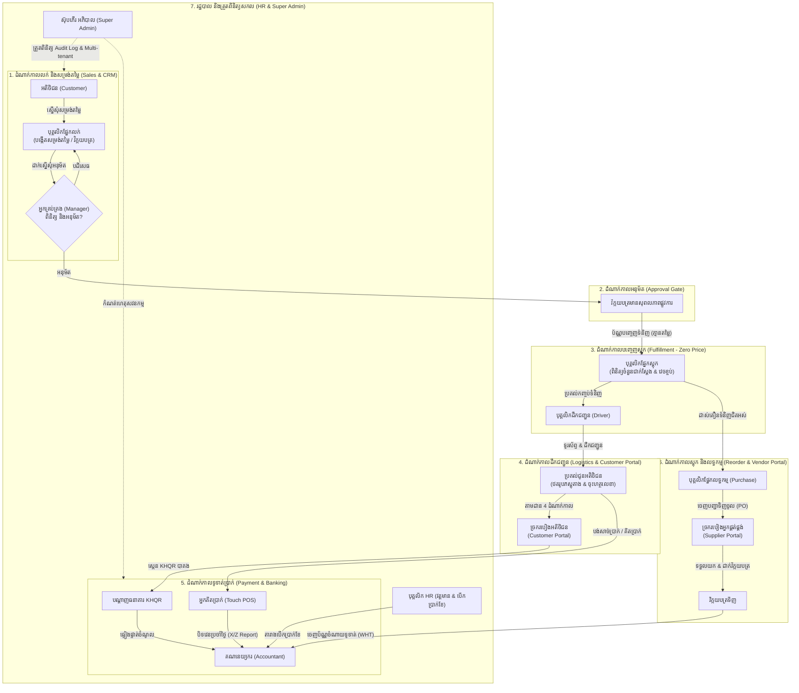

# DIGITECHKH Business Management System (BMS)
## មគ្គទេសក៍លំហូរការងាររួមឆ្លងកាត់គ្រប់តួនាទីទាំង 12 (End-to-End System Workflow Guide)

- **កំណែប្រែ (Version)**: 1.0
- **កាលបរិច្ឆេទ**: 17 កញ្ញា 2026
- **គោលបំណង**: ពន្យល់លម្អិតអំពីរបៀបដែលតួនាទីទាំង 12 ធ្វើការរួមគ្នាក្នុងសង្វាក់អាជីវកម្មតែមួយ

---

## 1. ដ្យាក្រាមលំហូរការងាររួម (Master Operational Flowchart)

ប្រព័ន្ធ DIGITECHKH BMS ភ្ជាប់ទំនាក់ទំនងរវាង **អតិថិជន, ផ្នែកលក់, អ្នកគ្រប់គ្រង, ឃ្លាំងស្តុក, អ្នកដឹកជញ្ជូន, គណនេយ្យករ, ផ្នែកលទ្ធកម្ម, អ្នកផ្គត់ផ្គង់, HR, និងអ្នកគិតប្រាក់** ដូចដ្យាក្រាមខាងក្រោម៖

---

## 2. វដ្តអាជីវកម្មលម្អិតទាំង 8 (8 Detailed Operational Cycles)

### វដ្តទី 1៖ សង្វាក់លក់ និងសម្រង់តម្លៃ (Commercial Cycle)
1. **បុគ្គលិកលក់** ចុះឈ្មោះអតិថិជនថ្មីក្នុង [create-customer.html](file:///d:/DATA/Project/bms_protoype_v1/frontend/src/pages/9-portals/sales-staff/create-customer.html) ដោយកំណត់កម្រិតអតិថិជន (រាយ, ដុំ, VIP) និងដែនកំណត់ជំពាក់ (Credit Limit)។
2. បង្កើតសម្រង់តម្លៃក្នុង [create-quote.html](file:///d:/DATA/Project/bms_protoype_v1/frontend/src/pages/9-portals/sales-staff/create-quote.html) ជូនអតិថិជន ដោយកំណត់កាលបរិច្ឆេទសុពលភាព។
3. នៅពេលអតិថិជនយល់ព្រម បុគ្គលិកលក់បម្លែងទៅជាវិក្កយបត្រក្នុង [create-invoice.html](file:///d:/DATA/Project/bms_protoype_v1/frontend/src/pages/9-portals/sales-staff/create-invoice.html) ដោយប្រព័ន្ធគណនាតម្លៃឌីណាមិកតាមកម្រិតអតិថិជន, ចូលរួមមុន (Down Payment), ការបញ្ចុះតម្លៃពិសេស និងពន្ធ អតប 10% ស្វ័យប្រវត្តិ។

### វដ្តទី 2៖ ការត្រួតពិនិត្យ និងអនុម័ត (Management & Governance Cycle)
1. រាល់វិក្កយបត្រ ឬបញ្ជាទិញដែលមានទំហំទឹកប្រាក់ធំ នឹងរត់ចូលទៅកាន់ជួររង់ចាំការអនុម័ត [approvals.html](file:///d:/DATA/Project/bms_protoype_v1/frontend/src/pages/9-portals/manager/approvals.html) របស់ **អ្នកគ្រប់គ្រង**។
2. អ្នកគ្រប់គ្រងចុចមើលព័ត៌មានលម្អិតក្នុង [view-approval.html](file:///d:/DATA/Project/bms_protoype_v1/frontend/src/pages/9-portals/manager/view-approval.html) ដើម្បីពិនិត្យមុខទំនិញ ចំនួន និងលក្ខខណ្ឌទូទាត់។
3. អ្នកគ្រប់គ្រងចុច «អនុម័ត» ឬ «បដិសេធ» ដោយបញ្ចូលមូលហេតុច្បាស់លាស់ ដែលត្រូវបានកត់ត្រាក្នុងកំណត់ហេតុសវនកម្ម (Audit Trail)។

### វដ្តទី 3៖ ការបញ្ចេញទំនិញពីឃ្លាំងដោយសុវត្ថិភាព (Warehouse Dispatch - Zero Price)
1. នៅពេលវិក្កយបត្រត្រូវបានអនុម័ត ប្រព័ន្ធបង្កើតប័ណ្ណបញ្ចេញទំនិញបញ្ជូនទៅកាន់ **បុគ្គលិកស្តុក**។
2. បុគ្គលិកស្តុកពិនិត្យតុល្យភាពក្នុង [balance.html](file:///d:/DATA/Project/bms_protoype_v1/frontend/src/pages/9-portals/inventory-staff/balance.html) — **ដោយគ្មានទិន្នន័យតម្លៃទិញ ឬតម្លៃលក់ឡើយ (Zero Price Leakage)**។
3. ប្រសិនបើមានការខូចខាត ឬរាប់មិនស្មើ បុគ្គលិកស្តុកធ្វើការកែតម្រូវចំនួនជាក់ស្តែងក្នុង [adjust-balance.html](file:///d:/DATA/Project/bms_protoype_v1/frontend/src/pages/9-portals/inventory-staff/adjust-balance.html)។
4. បុគ្គលិកស្តុករៀបចំកញ្ចប់ទំនិញ រួចប្រគល់ជូនបុគ្គលិកដឹកជញ្ជូន។

### វដ្តទី 4៖ ការដឹកជញ្ជូន និងការតាមដានរបស់អតិថិជន (Logistics & Customer Tracking)
1. **បុគ្គលិកដឹកជញ្ជូន** បើកមើលបញ្ជីដឹកថ្ងៃនេះក្នុង [my-deliveries.html](file:///d:/DATA/Project/bms_protoype_v1/frontend/src/pages/9-portals/driver/my-deliveries.html) (**គ្មានតម្លៃទឹកប្រាក់**)។
2. ចុចប៊ូតុងទូរស័ព្ទ `tel:...` ហៅទៅកាន់អតិថិជនមុនពេលទៅដល់។
3. **អតិថិជន** អាចចូលមើលស្ថានភាពនៃការដឹកជញ្ជូន 4 ដំណាក់កាលបន្តផ្ទាល់តាមរយៈ [order-tracking.html](file:///d:/DATA/Project/bms_protoype_v1/frontend/src/pages/9-portals/customer/order-tracking.html) (បានបញ្ជាទិញ → រៀបចំទំនិញ → កំពុងដឹកជញ្ជូន → បានប្រគល់) ព្រមទាំងឃើញឈ្មោះ និងលេខទូរស័ព្ទអ្នកដឹក។
4. នៅពេលទៅដល់ អ្នកដឹកបើក [delivery-detail.html](file:///d:/DATA/Project/bms_protoype_v1/frontend/src/pages/9-portals/driver/delivery-detail.html) ឱ្យអតិថិជនចុះហត្ថលេខាលើអេក្រង់ និងថតរូបភស្តុតាងប្រគល់ទំនិញ។

### វដ្តទី 5៖ ការទូទាត់ប្រាក់ និងការបិទវេន (Payment, POS & Shift Reconciliation)
1. **ជម្រើសទូទាត់ឌីជីថល**: អតិថិជនបើក [view-invoice.html](file:///d:/DATA/Project/bms_protoype_v1/frontend/src/pages/9-portals/customer/view-invoice.html) លើ Customer Portal ហើយស្កេនកូដ **KHQR បាគង** តាម App ធនាគារណាមួយ (ABA, ACLEDA, Wing, etc.)។
2. **ជម្រើសទូទាត់នៅបញ្ជរ**: ប្រសិនបើជាការលក់រាយ **អ្នកគិតប្រាក់** ប្រើប្រាស់ផ្ទាំង Touch POS [dashboard.html](file:///d:/DATA/Project/bms_protoype_v1/frontend/src/pages/9-portals/cashier/dashboard.html) គិតប្រាក់រហ័ស។
3. នៅចុងបញ្ចប់នៃវេនការងារ អ្នកគិតប្រាក់ចូលទៅកាន់ [close-shift.html](file:///d:/DATA/Project/bms_protoype_v1/frontend/src/pages/9-portals/cashier/close-shift.html) ដើម្បីរាប់សាច់ប្រាក់ជាក់ស្តែងក្នុងថតប្រាក់ ($480.00) ផ្ទៀងផ្ទាត់ជាមួយប្រព័ន្ធ រកឃើញភាពខុសគ្នា (Over/Short) និងបោះពុម្ពរបាយការណ៍បិទវេន (X/Z Report)។

### វដ្តទី 6៖ ការផ្ទៀងផ្ទាត់គណនេយ្យ និងពន្ធដារ (Accounting & Financial Audit)
1. **គណនេយ្យករ** ពិនិត្យការទូទាត់ដែលបានចូល និងបញ្ជាក់លើ [payments.html](file:///d:/DATA/Project/bms_protoype_v1/frontend/src/pages/9-portals/accountant/payments.html)។
2. បង្កើតប័ណ្ណចំណាយទូទាត់ប្រាក់ [create-disbursement.html](file:///d:/DATA/Project/bms_protoype_v1/frontend/src/pages/9-portals/accountant/create-disbursement.html) សម្រាប់ថ្លៃទំនិញ ឬចំណាយប្រតិបត្តិការ ដោយកាត់ពន្ធកាត់ទុក (WHT) តាមច្បាប់ពន្ធដារកម្ពុជា។
3. បោះពុម្ពប័ណ្ណចំណាយផ្លូវការកម្រិតសហគ្រាស [view-voucher.html](file:///d:/DATA/Project/bms_protoype_v1/frontend/src/pages/9-portals/accountant/view-voucher.html) ដែលមាន 4 ហត្ថលេខា (អ្នករៀបចំ, ប្រធានគណនេយ្យ, នាយកអនុម័ត, អ្នកទទួលប្រាក់)។
4. ទាញយកតារាងកត់ត្រាពន្ធ អតប 10% និងរបាយការណ៍ចំណេញខាត (P&L) ក្នុង [reports.html](file:///d:/DATA/Project/bms_protoype_v1/frontend/src/pages/9-portals/accountant/reports.html)។

### វដ្តទី 7៖ ការបំពេញស្តុក និងច្រករបៀងអ្នកផ្គត់ផ្គង់ (Procurement & Vendor Restock)
1. នៅពេលទំនិញដល់កម្រិតដាស់តឿនអប្បបរមា **បុគ្គលិកផ្នែកលទ្ធកម្ម** ចេញបញ្ជាទិញចូល (PO) ក្នុង [create-bill.html](file:///d:/DATA/Project/bms_protoype_v1/frontend/src/pages/9-portals/purchase-staff/create-bill.html)។
2. **អ្នកផ្គត់ផ្គង់** ចូលទៅកាន់ Supplier Portal ពិនិត្យ PO ក្នុង [view-order.html](file:///d:/DATA/Project/bms_protoype_v1/frontend/src/pages/9-portals/supplier/view-order.html) ហើយចុច «ទទួលយកការបញ្ជាទិញ»។
3. បន្ទាប់ពីដឹកជញ្ជូនទំនិញដល់ឃ្លាំង អ្នកផ្គត់ផ្គង់ដាក់ស្នើវិក្កយបត្រទូទាត់ក្នុង [submit-bill.html](file:///d:/DATA/Project/bms_protoype_v1/frontend/src/pages/9-portals/supplier/submit-bill.html) ដោយភ្ជាប់ឯកសារ PDF/រូបភាព។
4. គណនេយ្យករទទួលការជូនដំណឹង ហើយរៀបចំការទូទាត់តាមកាលបរិច្ឆេទកំណត់។

### វដ្តទី 8៖ ធនធានមនុស្ស និងប្រាក់បៀវត្សរ៍ (HR & Payroll Management)
1. **បុគ្គលិក HR** ចុះឈ្មោះបុគ្គលិកថ្មីក្នុង [create-employee.html](file:///d:/DATA/Project/bms_protoype_v1/frontend/src/pages/9-portals/hr-staff/create-employee.html) ដោយបញ្ចូលប្រាក់ខែគោល, លេខកាត ប.ស.ស (NSSF), និងគណនីធនាគារ។
2. តាមដានវត្តមានស្កេនម្រាមដៃប្រចាំថ្ងៃក្នុង [attendance.html](file:///d:/DATA/Project/bms_protoype_v1/frontend/src/pages/9-portals/hr-staff/attendance.html) និងអនុម័តច្បាប់ឈប់សម្រាកក្នុង [leave.html](file:///d:/DATA/Project/bms_protoype_v1/frontend/src/pages/9-portals/hr-staff/leave.html)។
3. នៅចុងខែ បង្កើតបញ្ជីបើកប្រាក់បៀវត្សរ៍ក្នុង [payroll.html](file:///d:/DATA/Project/bms_protoype_v1/frontend/src/pages/9-portals/hr-staff/payroll.html) និងបោះពុម្ពប័ណ្ណបើកប្រាក់បៀវត្សរ៍ផ្លូវការ A4 ជូនបុគ្គលិកម្នាក់ៗតាម [view-payslip.html](file:///d:/DATA/Project/bms_protoype_v1/frontend/src/pages/9-portals/hr-staff/view-payslip.html)។

---

## 3. តារាងតម្រងទិន្នន័យរវាងតួនាទី (Data Sharing Matrix & Privacy Filter)

| ព័ត៌មានទិន្នន័យ (Data Field) | ថ្នាក់ដឹកនាំ (Admin/Manager) | ផ្នែកលក់ (Sales) | ស្តុកទំនិញ (Inventory) | អ្នកដឹក (Driver) | គណនេយ្យ (Accountant) | អ្នកគិតប្រាក់ (Cashier) | អតិថិជន (Customer) | អ្នកផ្គត់ផ្គង់ (Supplier) |
|---|:---:|:---:|:---:|:---:|:---:|:---:|:---:|:---:|
| **ឈ្មោះ និងបរិមាណទំនិញ** | ពេញលេញ | ពេញលេញ | ពេញលេញ | ពេញលេញ | ពេញលេញ | ពេញលេញ | ឃើញតែរបស់ខ្លួន | ឃើញតែរបស់ខ្លួន |
| **តម្លៃលក់ (Selling Price)** | ពេញលេញ | ពេញលេញ | ❌ **លាក់ 100%** | ❌ **លាក់ 100%** | ពេញលេញ | ពេញលេញ | ឃើញតែរបស់ខ្លួន | ❌ លាក់ |
| **ថ្លៃដើមទិញចូល (Cost Price)** | ពេញលេញ | ❌ **លាក់** | ❌ **លាក់ 100%** | ❌ **លាក់ 100%** | ពេញលេញ | ❌ **លាក់** | ❌ លាក់ | ឃើញតែរបស់ខ្លួន |
| **ប្រាក់ចំណេញសរុប (Profit/Margin)** | ពេញលេញ | ❌ **លាក់** | ❌ **លាក់ 100%** | ❌ **លាក់ 100%** | ពេញលេញ | ❌ **លាក់** | ❌ លាក់ | ❌ លាក់ |
| **ប្រវត្តិលក់ខែមុនៗ** | ពេញលេញ | ឃើញតែរបស់ខ្លួន | ពេញលេញ (ចំនួន) | ❌ លាក់ | ពេញលេញ | ❌ **ជាប់សោរវេនថ្ងៃនេះ** | ឃើញតែរបស់ខ្លួន | ❌ លាក់ |
| **ព័ត៌មានអតិថិជន និងលេខទូរស័ព្ទ** | ពេញលេញ | ឃើញតែរបស់ខ្លួន | ❌ លាក់ | ពេញលេញ (ចុចខល) | ពេញលេញ | ឈ្មោះអតិថិជន | ព័ត៌មានផ្ទាល់ខ្លួន | ❌ លាក់ |
| **កំណត់ហេតុសវនកម្ម (Audit Log)** | ពេញលេញ | ❌ លាក់ | ❌ លាក់ | ❌ លាក់ | ❌ លាក់ | ❌ លាក់ | ❌ លាក់ | ❌ លាក់ |
