# DIGITECHKH Business Management System (BMS)
## សៀវភៅណែនាំប្រតិបត្តិការប្រព័ន្ធ និងផែនការផ្ទៀងផ្ទាត់មួយតួនាទីម្តងៗ (User Operational Guide & Step-by-Step Roadmap)

- **កំណែប្រែ (Version)**: 1.0
- **កាលបរិច្ឆេទ**: 17 កញ្ញា 2026
- **គោលដៅ**: មគ្គទេសក៍ជាក់ស្តែងសម្រាប់សាកល្បងប្រព័ន្ធ និងផែនការត្រួតពិនិត្យមួយតួនាទីម្តងៗជាមួយអ្នកប្រើប្រាស់

---

## 1. របៀបសាកល្បង និងរុករកប្រព័ន្ធជាក់ស្តែង (How to Test & Navigate)

### ជំហានទី 1៖ ចូលទៅកាន់ទំព័រ Login
1. បើកឯកសារ [login.html](file:///d:/DATA/Project/bms_protoype_v1/frontend/src/pages/1-login/login.html) លើ Google Chrome, Microsoft Edge ឬ Browser ណាមួយ។
2. ផ្ទាំង Login បច្ចុប្បន្នមានទម្រង់ស្អាតស្អំ (Clean & Elegant) ជាមួយប្រអប់បញ្ចូលទទេស្អាត។
3. នៅពីក្រោមប៊ូតុង **«ចូលប្រព័ន្ធ»** ចុចលើប៊ូតុង **«ជ្រើសរើសតួនាទីសាកល្បង»**។

### ជំហានទី 2៖ ជ្រើសរើសតួនាទីដែលចង់សាកល្បង
- ផ្ទាំង Modal នឹងបើកឡើងបង្ហាញជម្រើសទាំង 12 តួនាទីយ៉ាងស្រស់ស្អាត។
- ចុចលើតួនាទីណាមួយ ប្រព័ន្ធនឹងបញ្ជូនអ្នកទៅកាន់ Dashboard ជាក់ស្តែងនៃតួនាទីនោះភ្លាមៗ។

### ជំហានទី 3៖ ការផ្លាស់ប្តូរតួនាទីរហ័ស
- នៅលើ Sidebar ខាងឆ្វេង (ឬផ្នែកខាងក្រោមនៃ Sidebar ក្នុង Super Admin) មានប៊ូតុងសម្រាប់ត្រឡប់ ឬផ្លាស់ប្តូរតួនាទីសាកល្បងបានគ្រប់ពេលវេលា ដោយមិនចាំបាច់ Log out វិញឡើយ។

---

## 2. ផែនការផ្ទៀងផ្ទាត់លម្អិតមួយតួនាទីម្តងៗ (Role-by-Role Verification Plan)

ដើម្បីធានាបាននូវគុណភាពកម្រិតខ្ពស់បំផុត និងកុំឱ្យមានភាពរញ៉េរញ៉ៃ យើងនឹងត្រួតពិនិត្យប្រព័ន្ធ **មួយតួនាទីម្តងៗ (One Role at a Time)** ដោយរង់ចាំការបញ្ជាក់ និងយល់ព្រម (Confirmation) ពីលោកអ្នកលើតួនាទីនីមួយៗ ទើបបន្តទៅកាន់តួនាទីបន្ទាប់៖

```mermaid
flowchart LR
    R1["1. ស៊ុបភើរ អភិបាល<br/>(Super Admin)"] --> R2["2. អ្នកគ្រប់គ្រងទូទៅ<br/>(Admin)"]
    R2 --> R3["3. អ្នកគ្រប់គ្រង<br/>(Manager)"]
    R3 --> R4["4. បុគ្គលិកផ្នែកលក់<br/>(Sales Staff)"]
    R4 --> R5["5. អ្នកគិតប្រាក់<br/>(Touch POS)"]
    R5 --> R6["6. គណនេយ្យករ<br/>(Accountant)"]
    R6 --> R7["7. បុគ្គលិកផ្នែកលទ្ធកម្ម<br/>(Purchase Staff)"]
    R7 --> R8["8. បុគ្គលិកផ្នែកស្តុក<br/>(Inventory Staff)"]
    R8 --> R9["9. បុគ្គលិកដឹកជញ្ជូន<br/>(Delivery Driver)"]
    R9 --> R10["10. បុគ្គលិក HR<br/>(HR Staff)"]
    R10 --> R11["11. ដៃគូផ្គត់ផ្គង់<br/>(Supplier Portal)"]
    R11 --> R12["12. អតិថិជន<br/>(Customer Portal)"]
```

### លំដាប់នៃការផ្ទៀងផ្ទាត់ (Verification Sequence):
1. **តួនាទីទី 1៖ ស៊ុបភើរ អភិបាល (Super Admin)** $\leftarrow$ *(ត្រៀមចាប់ផ្តើមត្រួតពិនិត្យមុនគេ)*
   - ពិនិត្យការគ្រប់គ្រង Multi-tenant ក្រុមហ៊ុន, ការ Onboard ក្រុមហ៊ុនថ្មី, កញ្ចប់សេវា Subscription, កូតាគណនី, និងកំណត់ហេតុសវនកម្មសកល។
2. **តួនាទីទី 2៖ អ្នកគ្រប់គ្រងទូទៅ (Admin)**
   - ពិនិត្យសិទ្ធិគ្រប់គ្រងអាជីវកម្មពេញលេញ, ការលក់, ការទិញ, ស្តុក, របាយការណ៍ និងការកំណត់។
3. **តួនាទីទី 3៖ អ្នកគ្រប់គ្រង (Manager)**
   - ពិនិត្យការអនុម័ត និងបដិសេធវិក្កយបត្រ, សម្រង់តម្លៃ, បញ្ជាទិញចូល, និងមូលហេតុសវនកម្ម។
4. **តួនាទីទី 4៖ បុគ្គលិកផ្នែកលក់ (Sales Staff)**
   - ពិនិត្យការបង្កើតវិក្កយបត្រឌីណាមិកតាមកម្រិតអតិថិជន, សម្រង់តម្លៃ, ការគ្រប់គ្រងអតិថិជន និងការលាក់ថ្លៃដើម។
5. **តួនាទីទី 5៖ អ្នកគិតប្រាក់លក់រហ័ស (Cashier Touch POS)**
   - ពិនិត្យផ្ទាំង Touch Screen, កន្ត្រកទំនិញ, ប្រវត្តិជាប់សោរវេនថ្ងៃនេះ, និងផ្ទាំងបិទវេនប្រចាំថ្ងៃ (X/Z Report)។
6. **តួនាទីទី 6៖ គណនេយ្យករ (Accountant)**
   - ពិនិត្យការចេញប័ណ្ណចំណាយទូទាត់ (Voucher), ការកាត់ពន្ធកាត់ទុក (WHT), ពន្ធ អតប 10%, ប័ណ្ណបោះពុម្ព A4 មាន 4 ហត្ថលេខា។
7. **តួនាទីទី 7៖ បុគ្គលិកផ្នែកលទ្ធកម្ម (Purchase Staff)**
   - ពិនិត្យការចេញ PO ទៅកាន់អ្នកផ្គត់ផ្គង់, ការកត់ត្រាថ្លៃដើមទិញ, និងការតាមដានការទូទាត់។
8. **តួនាទីទី 8៖ បុគ្គលិកផ្នែកស្តុកទំនិញ (Inventory Staff)**
   - ពិនិត្យតុល្យភាពស្តុក, ការកែតម្រូវចំនួនរាប់ជាក់ស្តែង, ចលនាផ្ទេរទំនិញ, និងការធានា Zero Price Leakage (លាក់តម្លៃ 100%)។
9. **តួនាទីទី 9៖ បុគ្គលិកដឹកជញ្ជូន (Delivery Driver)**
   - ពិនិត្យបញ្ជីដឹកជញ្ជូន, ប៊ូតុងទូរស័ព្ទចុចខល, ផ្ទាំងថតរូបភស្តុតាង, ហត្ថលេខាទទួល និងការលាក់តម្លៃទឹកប្រាក់។
10. **តួនាទីទី 10៖ បុគ្គលិកធនធានមនុស្ស និងរដ្ឋបាល (HR Staff)**
    - ពិនិត្យការចុះឈ្មោះបុគ្គលិក, វត្តមានស្កេនម្រាមដៃ, ច្បាប់ឈប់សម្រាក, បញ្ជីបើកប្រាក់ខែ, ប័ណ្ណបើកប្រាក់ A4 (ប.ស.ស)។
11. **តួនាទីទី 11៖ ច្រករបៀងដៃគូផ្គត់ផ្គង់ (Supplier Portal)**
    - ពិនិត្យការទទួលយកការបញ្ជាទិញ (PO), ការដាក់ស្នើវិក្កយបត្រទូទាត់ និងការភ្ជាប់ឯកសារ។
12. **តួនាទីទី 12៖ ច្រករបៀងអតិថិជន (Customer Portal)**
    - ពិនិត្យវិក្កយបត្រ, ការស្កេន KHQR បាគងឌីណាមិក, និងការតាមដានការដឹកជញ្ជូន 4 ដំណាក់កាល។

---

## 3. ដំបូន្មានសំខាន់ៗសម្រាប់អ្នកទើបបង្កើតប្រព័ន្ធធំលើកដំបូង (Advice for Building Large Systems)

1. **កុំព្យាយាមធ្វើគ្រប់យ៉ាងក្នុងពេលតែមួយ**:
   - ប្រព័ន្ធធំៗ (ដូចជា Odoo, SAP) ត្រូវបានកសាងឡើងតាមម៉ូឌុល និងជំហានច្បាស់លាស់។
   - ត្រូវប្រាកដថាម៉ូឌុលនីមួយៗមានភាពរឹងមាំ គ្មានកំហុស និងបំពេញតម្រូវការជាក់ស្តែងមុននឹងបន្តទៅមុខ។
2. **ផ្តោតលើភាពត្រឹមត្រូវនៃទិន្នន័យ (Data Integrity)**:
   - ឯកសារហិរញ្ញវត្ថុដែលបានអនុម័តរួច (Confirmed) មិនត្រូវលុបចោលឡើយ (ត្រូវប្រើប្រាស់ Void/Cancel ជំនួសវិញ) ដើម្បីរក្សាភាពស្អាតនៃសវនកម្ម។
   - តម្លៃទឹកប្រាក់ និងបរិមាណត្រូវគណនាដោយ Server មិនត្រូវទុកចិត្តលើការគណនារបស់ Browser ឡើយ។
3. **សុវត្ថិភាពឯកជនភាព (Data Privacy) គឺជាអាទិភាពចម្បង**:
   - បុគ្គលិកថ្នាក់ប្រតិបត្តិការ (ដូចជា ឃ្លាំង និងអ្នកដឹក) មិនត្រូវដឹងថ្លៃដើម ឬប្រាក់ចំណេញរបស់ក្រុមហ៊ុនឡើយ។ ការអនុវត្ត Zero Price Leakage នៅក្នុងប្រព័ន្ធនេះគឺជាការការពារអាជីវកម្មដ៏រឹងមាំបំផុត។
4. **ការបណ្តុះបណ្តាល និងឯកសារណែនាំ (Documentation & Training)**:
   - ប្រព័ន្ធល្អ គឺប្រព័ន្ធដែលអ្នកប្រើប្រាស់ងាយយល់ និងមានឯកសារច្បាស់លាស់។
   - ឯកសារដែលយើងកំពុងរៀបចំនេះ នឹងក្លាយជាគ្រឹះសម្រាប់បណ្តុះបណ្តាលបុគ្គលិក និងដៃគូអាជីវកម្មនៅពេលប្រព័ន្ធដាក់ឱ្យប្រើប្រាស់ជាក់ស្តែង។
