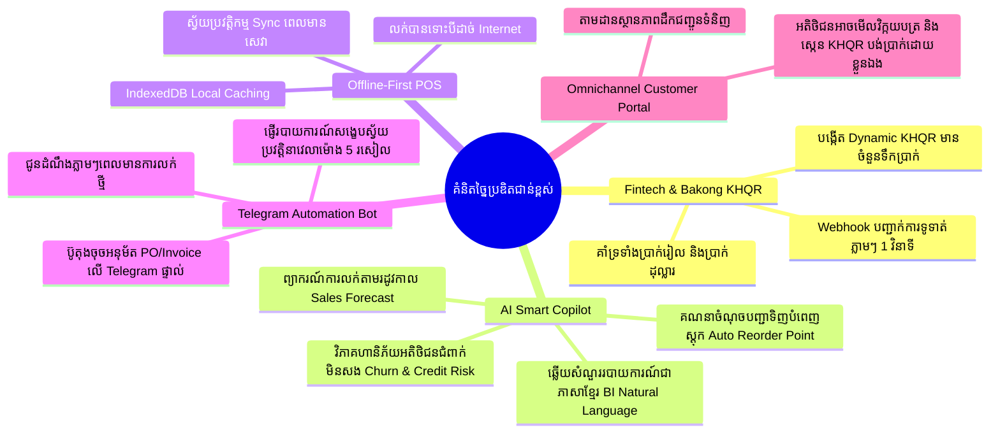

# DIGITECHKH BMS - ប្លង់មេស្ថាបត្យកម្មប្រព័ន្ធពេញលេញ និងផែនការអាជីវកម្មកម្រិតសហគ្រាស (Complete Enterprise Blueprint & System Master Plan)

ឯកសារនេះជាប្លង់មេស្ថាបត្យកម្មប្រព័ន្ធ និងយុទ្ធសាស្ត្រពង្រីកពេញលេញសម្រាប់គម្រោង **DIGITECHKH Business Management System (BMS)** ដោយរួមបញ្ចូលគ្នានូវមុខងារ **ERP**, **CRM**, **WMS**, **POS**, **Accounting & Finance (ទ្វេបញ្ជី)**, **HRM & Payroll**, និង **Fintech / AI Automation** ស្របតាមស្តង់ដារគុណភាពកម្រិតសហគ្រាស (Enterprise-Grade Standards)។

---

## 1. ចក្ខុវិស័យ និងគោលដៅប្រព័ន្ធ (Vision & Objectives)

ប្រព័ន្ធ **DIGITECHKH BMS** ត្រូវបានរចនាឡើងដើម្បីក្លាយជា **ប្រព័ន្ធអេកូឡូស៊ីគ្រប់គ្រងអាជីវកម្មឆ្លាតវៃកម្រិតសហគ្រាស (All-in-One Enterprise Business Ecosystem)** ដែលអាចដំណើរការបានទាំងសម្រាប់អាជីវកម្មខ្នាតតូច មធ្យម (SMEs) រហូតដល់សហគ្រាសធំៗដែលមានសាខាច្រើន (Multi-Branch Franchises)៖

1. **ការតភ្ជាប់ទិន្នន័យគ្មានថ្នេរ (Seamless Data Continuity)**៖ រាល់ប្រតិបត្តិការពីផ្នែកលក់ រាយ/ដុំ ឃ្លាំងស្តុក លទ្ធកម្ម និងគណនេយ្យ ត្រូវរត់តភ្ជាប់គ្នាដោយស្វ័យប្រវត្តិតាមរយៈ Single Source of Truth។
2. **គ្មានការលេចធ្លាយទិន្នន័យ (Zero Data-Leakage Multi-Role RBAC)**៖ 12 តួនាទីផ្ទៃក្នុង + 2 ច្រករបៀងខាងក្រៅ មើលឃើញ និងអនុវត្តបានតែលើទិន្នន័យដែលស្របតាមសិទ្ធិរបស់ខ្លួនប៉ុណ្ណោះ។
3. **ស្តង់ដារបទដ្ឋានជាតិកម្ពុជា 100%**៖ ភាសាខ្មែរសុទ្ធសាធលើ UI, ប្រព័ន្ធបង់ប្រាក់ NBC Bakong KHQR (ទាំង USD និង KHR), ពន្ធរដ្ឋ អតប 10%, និងការបោះពុម្ពឯកសារ A4 ផ្លូវការ។

---

## 2. ស្ថាបត្យកម្មប្រព័ន្ធពេញលេញ (System Architecture Topology)

```mermaid
flowchart TB
    subgraph UI_Layer["1. ស្រទាប់ចំណុចប្រទាក់អ្នកប្រើប្រាស់ (User Interface Layer)"]
        Web_App["Web Application\n(Modular Vanilla JS / TailwindCSS)"]
        POS_PWA["Point of Sale PWA\n(Offline-First / ESC/POS Thermal Print)"]
        Portals["Portal អតិថិជន & អ្នកផ្គត់ផ្គង់\n(External Self-Service Portals)"]
    end

    subgraph Gateway_Layer["2. ស្រទាប់ច្រកទ្វារ & សុវត្ថិភាព (Gateway & Security Layer)"]
        Nginx["Nginx Reverse Proxy / SSL Gateway"]
        Auth_Guard["JWT / RBAC Security Guard (12 Roles Data Scope)"]
        Rate_Limiter["Rate Limiting & DDoS Shield"]
    end

    subgraph Service_Layer["3. ស្រទាប់សេវាកម្មស្នូល (Enterprise Core Services / Modular Monolith)"]
        CRM_Service["CRM & Sales Service\n(Quotes, Orders, Invoices, Customers)"]
        POS_Service["POS & Retail Service\n(Quick Checkout, Shifts, Bakong KHQR)"]
        WMS_Service["WMS & Inventory Service\n(Multi-Warehouse, Lots, Barcodes)"]
        Procure_Service["Procurement Service\n(Suppliers, POs, Bills, Expenses)"]
        Finance_Service["Finance & GL Service\n(Double-Entry, Tax 10%, Financial Statements)"]
        HRM_Service["HRM & Payroll Service\n(Attendance, Shifts, Salary Slips)"]
        Workflow_Engine["Workflow & Approval Engine\n(Multi-Tier Rules, Escalations)"]
        Notification_Bus["Notification Bus\n(Telegram Bot, Push, SMS, Email)"]
    end

    subgraph Data_Layer["4. ស្រទាប់ទិន្នន័យ & ឃ្លាំងផ្ទុក (Persistence & Storage Layer)"]
        Postgres[(PostgreSQL Relational DB\nMulti-Tenant Schema)]
        Redis[(Redis In-Memory Cache\nSessions & Rate Limits)]
        Blob_Store[(Document & Attachment Store\nInvoices, Receipts, Contracts)]
    end

    UI_Layer --> Gateway_Layer
    Gateway_Layer --> Service_Layer
    Service_Layer --> Data_Layer
```

---

## 3. ម៉ូឌុលស្នូលទាំង 8 នៃប្រព័ន្ធពេញលេញ (The 8 Enterprise Modules)

### ម៉ូឌុលទី 1៖ ផ្ទាំងគ្រប់គ្រង & វិភាគទិន្នន័យ (Executive Dashboard & BI Analytics)
* **មុខងារសំខាន់ៗ**៖
  - KPI ហិរញ្ញវត្ថុពេលជាក់ស្តែង (ចំណូលសរុប, ចំណាយសរុប, ប្រាក់ចំណេញសុទ្ធ, លំហូរសាច់ប្រាក់ Cashflow)
  - ក្រាហ្វនិន្នាការលក់ប្រចាំថ្ងៃ/ខែ/ត្រីមាស និងការប្រៀបធៀបកំណើន
  - ផ្ទាំងគ្រប់គ្រងរហ័សតាមតួនាទី (Custom Role-specific Widgets)
  - ការជូនដំណឹងឆ្លាតវៃ (មុខទំនិញជិតដាច់ស្តុក, វិក្កយបត្រហួសកាលកំណត់, សំណើសុំអនុម័តបន្ទាន់)

### ម៉ូឌុលទី 2៖ ទំនាក់ទំនងអតិថិជន & ការលក់ (CRM & Sales Management)
* **មុខងារសំខាន់ៗ**៖
  - **បំពង់លក់ (Sales Pipeline & Leads)**៖ តាមដានតំណាក់កាលអតិថិជនសក្តានុពល (Lead → Qualified → Proposal → Won/Lost)
  - **សម្រង់តម្លៃ (Quotations)**៖ ចេញសម្រង់តម្លៃរហ័ស បញ្ចូលលក្ខខណ្ឌទូទាត់ ការបញ្ចុះតម្លៃ និងបម្លែងទៅជាវិក្កយបត្រដោយចុច 1 Click
  - **វិក្កយបត្រលក់ (Invoices)**៖ គណនាពន្ធ អតប 10%, បញ្ចុះតម្លៃពិសេស, ចូលរួមមុន (Down Payment) និងប្រព័ន្ធ QR Code ទូទាត់ Bakong
  - **គ្រប់គ្រងអតិថិជន (Customer Profiles)**៖ បែងចែកកម្រិត (រាយ, ដុំ, តំណាងចែកចាយ), ប្រវត្តិកិច្ចសន្យា និងប្រវត្តិតម្លៃទិញពីមុន

### ម៉ូឌុលទី 3៖ ច្រកលក់រាយ & គិតលុយ (POS - Point of Sale & Retail)
* **មុខងារសំខាន់ៗ**៖
  - ការគិតលុយរហ័សលើអេក្រង់ Touchscreen / ម៉ាស៊ីនស្កេនបាកូដ
  - ដំណើរការបិទ/បើកវេនគិតលុយ (Cashier Shift Management & Cash Drawer Reconciliation)
  - បង្កើត Dynamic Bakong KHQR លើអេក្រង់ឱ្យអតិថិជនស្កេនទូទាត់ភ្លាមៗ និងផ្ទៀងផ្ទាត់ជោគជ័យស្វ័យប្រវត្តិ (Instant Webhook)
  - បោះពុម្ពវិក្កយបត្រខ្នាតតូច 80mm/58mm លើម៉ាស៊ីនបោះពុម្ពកម្តៅ (ESC/POS Thermal Printer)
  - ដំណើរការលក់បានទោះបីដាច់ Internet (Offline Mode) និង Sync មកវិញពេលមានសេវា

### ម៉ូឌុលទី 4៖ លទ្ធកម្ម & អ្នកផ្គត់ផ្គង់ (Procurement & Supplier Management)
* **មុខងារសំខាន់ៗ**៖
  - **សំណើសុំទិញ (Purchase Requisition - PR)**៖ ផ្នែកឃ្លាំង ឬផ្នែកលក់ស្នើសុំទិញទំនិញបំពេញស្តុក
  - **ការបញ្ជាទិញ (Purchase Orders - PO)**៖ ប្រធានលទ្ធកម្មត្រួតពិនិត្យ និងចេញប័ណ្ណបញ្ជាទិញផ្លូវការផ្ញើទៅកាន់អ្នកផ្គត់ផ្គង់
  - **វិក្កយបត្រទិញ & ប័ណ្ណចំណាយ (Bills & Disbursements)**៖ ផ្ទៀងផ្ទាត់ទំនិញចូលជាមួយវិក្កយបត្រទិញ (3-Way Matching: PO vs Receipt vs Bill) និងចេញប័ណ្ណចំណាយទូទាត់

### ម៉ូឌុលទី 5៖ ឃ្លាំង & ស្តុកទំនិញកម្រិតខ្ពស់ (Advanced Warehouse & Inventory - WMS)
* **មុខងារសំខាន់ៗ**៖
  - **ពហុឃ្លាំង & ទីតាំងស្តុក (Multi-Warehouse & Bin Locations)**៖ គ្រប់គ្រងឃ្លាំងធំ ឃ្លាំងរង និងទីតាំងជួរ/ធ្នើរទំនិញ
  - **ការផ្ទេរស្តុកអន្តរសាខា (Inter-Branch Stock Transfer)**៖ ប័ណ្ណស្នើសុំផ្ទេរ → ប័ណ្ណបញ្ជូនចេញ → ប័ណ្ណទទួលចូល
  - **ការតាមដានលេខឡូតិ៍ និងកាលបរិច្ឆេទផុតកំណត់ (Batch/Lot & Expiry Tracking)**៖ សម្រាប់ទំនិញឱសថ ចំណីអាហារ និងគ្រឿងអេឡិចត្រូនិក (FIFO/FEFO)
  - **ការរាប់ស្តុក និងកែសម្រួល (Stock Count & Adjustment)**៖ បិទបញ្ជីរាប់ស្តុកជាក់ស្តែង និងកត់ត្រាការបាត់បង់/ខូចខាត

### ម៉ូឌុលទី 6៖ គណនេយ្យ & ហិរញ្ញវត្ថុទ្វេបញ្ជី (Accounting, General Ledger & Finance)
* **មុខងារសំខាន់ៗ**៖
  - **តារាងគណនី (Chart of Accounts - COA)**៖ ចាត់ថ្នាក់ទ្រព្យសកម្ម បំណុល មូលធន ចំណូល និងចំណាយតាមបទដ្ឋានជាតិ
  - **សៀវភៅកំណត់ហេតុទូទៅ (General Journal & Ledger)**៖ រាល់វិក្កយបត្រលក់ វិក្កយបត្រទិញ និងការទូទាត់ត្រូវបានបង្កើត Double-entry Dr/Cr ដោយស្វ័យប្រវត្តិ
  - **របាយការណ៍ហិរញ្ញវត្ថុស្តង់ដារ**៖
    1. តារាងតុល្យការ (Balance Sheet)
    2. របាយការណ៍ចំណេញ-ខាត (Income / Profit & Loss Statement)
    3. របាយការណ៍លំហូរសាច់ប្រាក់ (Cash Flow Statement)
    4. តារាងសមតុល្យសាកល្បង (Trial Balance)
  - **ការផ្ទៀងផ្ទាត់ធនាគារ (Bank Reconciliation)**៖ ផ្ទៀងផ្ទាត់របាយការណ៍ធនាគារជាមួយកំណត់ត្រាប្រព័ន្ធ

### ម៉ូឌុលទី 7៖ ធនធានមនុស្ស & បៀវត្សរ៍ (HRM & Payroll Management)
* **មុខងារសំខាន់ៗ**៖
  - គ្រប់គ្រងព័ត៌មានបុគ្គលិក កិច្ចសន្យាការងារ និងឯកសារផ្ទាល់ខ្លួន
  - ស្រង់វត្តមានប្រចាំថ្ងៃ តាមម៉ាស៊ីនស្កេនមេដៃ/មុខ ឬ QR Code
  - ការគ្រប់គ្រងច្បាប់ឈប់សម្រាក (Leave Requests & Approvals)
  - គណនាប្រាក់បៀវត្សរ៍ ប្រាក់ថែមម៉ោង ប្រាក់កម្រៃជើងសារលក់ (Sales Commission) និងកាត់កងពន្ធលើប្រាក់បៀវត្សរ៍ ព្រមទាំងចេញប័ណ្ណបើកប្រាក់បៀវត្សរ៍ (Salary Slips)

### ម៉ូឌុលទី 8៖ ការកំណត់ប្រព័ន្ធ, សុវត្ថិភាព & សវនកម្ម (Administration & Multi-Tenant)
* **មុខងារសំខាន់ៗ**៖
  - គ្រប់គ្រងស្ថាប័នច្រើន (Multi-Company / Multi-Branch)
  - ការគ្រប់គ្រងសិទ្ធិជ្រៅដល់កម្រិតវាលទិន្នន័យ (Field-level & Action-level RBAC)
  - កំណត់ហេតុសវនកម្មដែលមិនអាចលុបបាន (Immutable Audit Logs - Who did What, When, and IP)
  - ការបម្រុងទុកទិន្នន័យស្វ័យប្រវត្តិ និងការស្តារប្រព័ន្ធឡើងវិញ (Automated Backup & Disaster Recovery)

---

## 4. ម៉ាទ្រីសសិទ្ធិអំណាចនៃតួនាទីទាំង 12 + ច្រករបៀងទាំង 2 (Role & Permissions Matrix)

| តួនាទី | Dashboard | សម្រង់តម្លៃ/លក់ | វិក្កយបត្រ | លទ្ធកម្ម/ទិញ | ឃ្លាំងស្តុក | គណនេយ្យ | របាយការណ៍ | ការកំណត់/Admin |
|---|:---:|:---:|:---:|:---:|:---:|:---:|:---:|:---:|
| **1. Super Admin** | សកល | មើល | មើល | មើល | មើល | មើល | សកល | ពេញលេញ |
| **2. Admin/GM** | ក្រុមហ៊ុន | ពេញលេញ | ពេញលេញ | ពេញលេញ | ពេញលេញ | ពេញលេញ | ពេញលេញ | កម្រិតស្ថាប័ន |
| **3. Sales Manager** | ផ្នែកលក់ | ពេញលេញ | ពេញលេញ | គ្មាន | មើលស្តុក | គ្មាន | របាយការណ៍លក់ | គ្មាន |
| **4. Sales Executive** | ផ្ទាល់ខ្លួន | បង្កើត/កែ | បង្កើត/កែ | គ្មាន | មើលស្តុក | គ្មាន | របាយការណ៍ផ្ទាល់ខ្លួន | គ្មាន |
| **5. Cashier / POS** | ច្រកលក់រាយ | គ្មាន | ចេញវិក្កយបត្ររាយ | គ្មាន | មើលស្តុក | ទទួលប្រាក់ | បិទវេនប្រចាំថ្ងៃ | គ្មាន |
| **6. Procurement Mgr**| ផ្នែកទិញ | គ្មាន | គ្មាន | ពេញលេញ | មើលស្តុក | ប័ណ្ណទិញ | របាយការណ៍ទិញ | គ្មាន |
| **7. Warehouse Mgr** | ផ្នែកស្តុក | គ្មាន | គ្មាន | ទទួលទំនិញ | ពេញលេញ | គ្មាន | របាយការណ៍ស្តុក | គ្មាន |
| **8. Warehouse Staff**| ឃ្លាំង | គ្មាន | គ្មាន | ពិនិត្យចូល | រាប់/រៀប/វេច | គ្មាន | ប័ណ្ណរាប់ | គ្មាន |
| **9. Chief Accountant**| ហិរញ្ញវត្ថុ | មើល | ផ្ទៀងផ្ទាត់ | ផ្ទៀងផ្ទាត់ | មើលតម្លៃដើម| ពេញលេញ | របាយការណ៍ហិរញ្ញវត្ថុ | ពន្ធ & អត្រាប្តូរ |
| **10. AP/AR Accountant**| បំណុល/ទារ | គ្មាន | តាមដានទារប្រាក់| តាមដានសងប្រាក់| គ្មាន | បង្កាន់ដៃ/ប័ណ្ណចំណាយ| តារាងបំណុល | គ្មាន |
| **11. Executive/Auditor**| សវនកម្ម | មើល | មើល | មើល | មើល | មើល | ពេញលេញ | មើលកំណត់ហេតុ |
| **12. Customer Support**| សេវាអតិថិជន| គ្មាន | មើលវិក្កយបត្រ | គ្មាន | មើលស្តុក | គ្មាន | គ្មាន | គ្មាន |
| **P1. Customer Portal** | វិបផតថល | ស្នើសុំតម្លៃ | មើល/ទាញយក/បង់| គ្មាន | គ្មាន | គ្មាន | គ្មាន | ព័ត៌មានផ្ទាល់ខ្លួន |
| **P2. Supplier Portal** | វិបផតថល | គ្មាន | គ្មាន | ទទួល PO / ដាក់ Bill | គ្មាន | គ្មាន | គ្មាន | ព័ត៌មានផ្គត់ផ្គង់ |

---

## 5. គំនិតច្នៃប្រឌិត និងបច្ចេកវិទ្យាជាន់ខ្ពស់ (Advanced Innovation Roadmap)

---

## 6. ផែនការអនុវត្តជាក់ស្តែង 4 ដំណាក់កាល (Implementation Roadmap)

### ដំណាក់កាលទី 1៖ គំរូទម្រង់ UI និងលំហូររុករក (Frontend Completeness - សម្រេចបាន 100%)
- បង្កើតទំព័រពេញលេញ 45+ ទំព័រ (តារាង, ទម្រង់បង្កើត, ទម្រង់កែប្រែ, បង្ហាញព័ត៌មានលម្អិត)។
- អនុវត្តស្តង់ដារ `72px` Header, Unified Date Range Picker, 100% Khmer Language, No Native Modals។
- គ្មាន Broken Links (0 broken links លើ 695 តំណភ្ជាប់)។

### ដំណាក់កាលទី 2៖ ស្ថាបត្យកម្ម Backend API & Database (Core Engine)
- រៀបចំ PostgreSQL Database Schema ដោយបែងចែក Multi-Tenant និង Master Data (អតិថិជន, អ្នកផ្គត់ផ្គង់, ផលិតផល, វិក្កយបត្រ, ស្តុក, គណនី)។
- បង្កើត RESTful API / RPC Service តាមបែប Modular Monolith ជាមួយ Node.js/NestJS ឬ Go/Python។
- បំពាក់ប្រព័ន្ធសុវត្ថិភាព JWT Auth, Refresh Token, និង Role Guards រឹងមាំ។

### ដំណាក់កាលទី 3៖ ការតភ្ជាប់ប្រព័ន្ធខាងក្រៅ (Integrations & Hardware)
- តភ្ជាប់ NBC Bakong KHQR Open API សម្រាប់ទទួលប្រាក់ស្វ័យប្រវត្តិ។
- តភ្ជាប់ Telegram Bot API សម្រាប់ប្រព័ន្ធជូនដំណឹងបន្ទាន់ និងរបាយការណ៍ល្ងាច។
- រៀបចំ Web-to-Hardware Printing សម្រាប់ម៉ាស៊ីនបោះពុម្ពកម្តៅ ESC/POS និង A4 Enterprise PDF Engine។

### ដំណាក់កាលទី 4៖ ការធានាគុណភាព និងដាក់ឱ្យប្រើប្រាស់ (QA Hardening & Deployment)
- អនុវត្តបញ្ជីត្រួតពិនិត្យ 3 ដំណាក់កាលតាមគំរូ ClassMaster៖ **D-7** (Code & DB Audit), **D-1** (System Freeze), **T-90** (Pre-Flight Launch Verification)។
- រៀបចំ Docker Containers, Nginx Reverse Proxy, Cloudflare SSL, និង Automated Nightly Backup។
- ចងក្រងមគ្គុទ្ទេសក៍បណ្តុះបណ្តាលបុគ្គលិកតាមតួនាទីនីមួយៗ។
