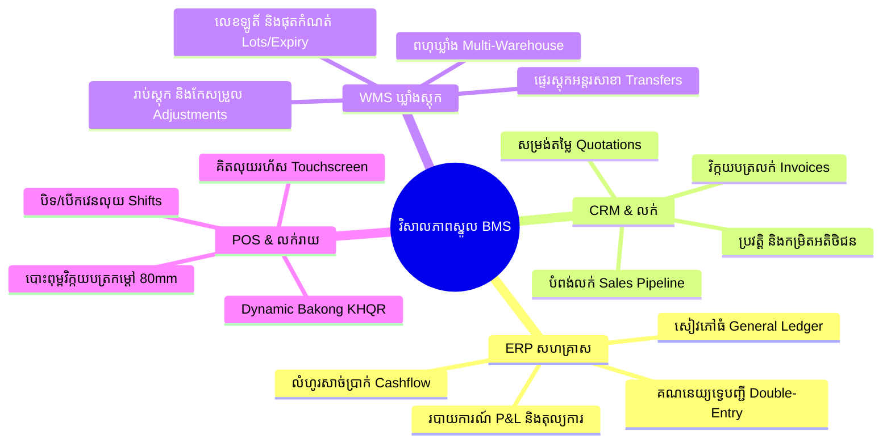
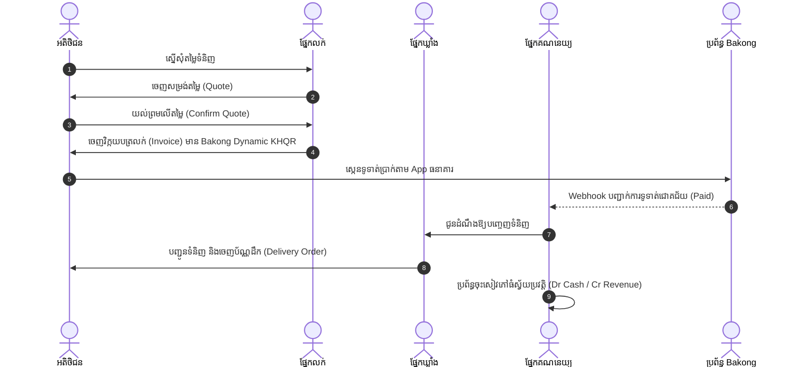

# ឯកសារពិពណ៌នាលម្អិតពេញលេញអំពីប្រព័ន្ធ និងមគ្គុទ្ទេសក៍ក្រុមការងារ (Comprehensive System Specification & Team Guide)

ឯកសារនេះត្រូវបានចងក្រងឡើងជាផ្លូវការ ក្នុងកម្រិតអាទិភាពខ្ពស់បំផុត (Highest Priority) សម្រាប់ជាមូលដ្ឋានគ្រឹះដល់**ក្រុមការងារអភិវឌ្ឍន៍ (Development Team), ក្រុមវិភាគអាជីវកម្ម (Business Analysts), ក្រុមធានាគុណភាព (QA), និងថ្នាក់ដឹកនាំគម្រោង (Project Stakeholders)** ក្នុងការស្វែងយល់យ៉ាងស៊ីជម្រៅអំពី៖ គោលបំណង, វិសាលភាព, ស្ថាបត្យកម្ម, ដំណើរការអាជីវកម្ម, និងការទទួលខុសត្រូវនៃតួនាទីនីមួយៗក្នុងប្រព័ន្ធ **DIGITECHKH Business Management System (BMS)**។

---

## ជំពូកទី 1៖ គោលបំណង និងទស្សនវិស័យនៃប្រព័ន្ធ (System Purpose & Vision)

### 1.1 បញ្ហាប្រឈមក្នុងអាជីវកម្មបច្ចុប្បន្ន (The Business Problem)
បច្ចុប្បន្ន អាជីវកម្មភាគច្រើននៅកម្ពុជាជួបប្រទះនូវបញ្ហាធំៗចំនួន 4៖
1. **ទិន្នន័យបែកខ្ញែក (Fragmented Data / Data Silos)**៖ ផ្នែកលក់ប្រើ Excel ឬក្រដាស, ផ្នែកគិតលុយប្រើម៉ាស៊ីន POS ដាច់ដោយឡែក, ផ្នែកឃ្លាំងកត់សៀវភៅ, ហើយផ្នែកគណនេយ្យត្រូវវាយបញ្ចូលទិន្នន័យឡើងវិញរាល់ចុងខែ។
2. **កំហុសមនុស្ស និងការខាតបង់ពេលវេលា (Human Errors & Operational Inefficiency)**៖ ការវាយបញ្ចូលទិន្នន័យដដែលៗបង្កឱ្យមានការភាន់ច្រឡំលើតួលេខ វិក្កយបត្រស្ទួន ឬទំនិញដាច់ស្តុកដោយមិនដឹងខ្លួន។
3. **ការលេចធ្លាយព័ត៌មានសម្ងាត់ (Security & Access Leakage)**៖ បុគ្គលិកគ្រប់គ្នាមើលឃើញទិន្នន័យលាយឡំគ្នា (ដូចជាបុគ្គលិកលក់ដឹងថ្លៃដើមទិញចូលរបស់អ្នកផ្គត់ផ្គង់) នាំឱ្យបាត់បង់អត្ថប្រយោជន៍ប្រកួតប្រជែង។
4. **កង្វះស្វ័យប្រវត្តិកម្ម និងការទូទាត់ឌីជីថល (Lack of Modern Integrations)**៖ មិនទាន់មានការតភ្ជាប់ដោយស្វ័យប្រវត្តិជាមួយប្រព័ន្ធទូទាត់ជាតិ Bakong KHQR និងប្រព័ន្ធផ្ញើសាររោទ៍ដំណឹងដូចជា Telegram។

### 1.2 ដំណោះស្រាយនៃប្រព័ន្ធ DIGITECHKH BMS (The Solution)
ប្រព័ន្ធ **DIGITECHKH BMS** ត្រូវបានបង្កើតឡើងជា **ប្រព័ន្ធគ្រប់គ្រងអាជីវកម្មឆ្លាតវៃកម្រិតសហគ្រាសរួមតែមួយ (All-in-One Enterprise Platform)** ដែល៖
* តភ្ជាប់គ្រប់ផ្នែកទាំងអស់ (លក់, ឃ្លាំង, លទ្ធកម្ម, គណនេយ្យ, បៀវត្សរ៍) ឱ្យរត់លើប្រភពទិន្នន័យរួមតែមួយ (Single Source of Truth)។
* បែងចែកសិទ្ធិយ៉ាងតឹងរ៉ឹងគ្មានការលេចធ្លាយទិន្នន័យ (Zero-Leakage Multi-Role RBAC)។
* គាំទ្រភាសាខ្មែរសុទ្ធសាធ 100% លេខអង់គ្លេស 0-9 ប្រព័ន្ធពន្ធដារជាតិ អតប 10% និងការទូទាត់ Bakong KHQR ទាំងដុល្លារ និងរៀល។

---

## ជំពូកទី 2៖ វិសាលភាពនៃប្រព័ន្ធ (Complete System Scope)

ប្រព័ន្ធគ្របដណ្តប់លើ 4 ដែនអាជីវកម្មស្នូល (4 Core Business Pillars)៖

---

## ជំពូកទី 3៖ ស្ថាបត្យកម្មប្រព័ន្ធ និងលំហូរទិន្នន័យ (Architecture & Data Flows)

### 3.1 ស្ថាបត្យកម្ម 4 ស្រទាប់ (4-Tier Enterprise Architecture)
1. **Client Presentation Tier**:
   - Web Management Portal (SPA Architecture, TailwindCSS, Kantumruy Pro)
   - Point of Sale PWA (Offline-first, LocalStorage/IndexedDB, WebHID/Serial for Thermal Printer)
   - Self-Service Portals (Customer & Supplier Web Portals)
2. **Gateway & Security Tier**:
   - Nginx Reverse Proxy (SSL Termination, Gzip/Brotli Compression, DDoS Rate Limiting)
   - JWT Auth & Dynamic RBAC Engine (ពិនិត្យ Tenant ID, Role ID, និង Permission Scope លើគ្រប់ API Call)
3. **Core Application Services Tier (Modular Monolith)**:
   - Sales & CRM Engine
   - POS & Cashier Shift Engine
   - Inventory & Warehouse Management Engine (WMS)
   - Procurement & 3-Way Matching Engine
   - Financial Accounting & General Ledger Engine
   - Telegram Bot & Notification Webhook Bus
4. **Data Persistence Tier**:
   - **PostgreSQL 16**៖ មូលដ្ឋានទិន្នន័យ Relational Schema គាំទ្រ Multi-Tenant Isolation
   - **Redis 7**៖ Memory Cache សម្រាប់ Session, Token Whitelist, និង Real-time Counters
   - **Storage Vault**៖ ឃ្លាំងផ្ទុកឯកសារភ្ជាប់ វិក្កយបត្រ PDF, រូបភាពផលិតផល, និងកិច្ចសន្យា

---

## ជំពូកទី 4៖ ម៉ូឌុលមុខងារទាំង 8 និងដំណើរការការងារ (The 8 Modules Breakdown)

### ម៉ូឌុលទី 1៖ ផ្ទាំងគ្រប់គ្រងប្រតិបត្តិ (Executive Dashboard & BI)
* **គោលបំណង**៖ ផ្តល់ទិដ្ឋភាពទូទៅនៃសុខភាពអាជីវកម្មដល់ថ្នាក់ដឹកនាំក្នុងពេលជាក់ស្តែង។
* **សូចនាករ KPI ស្នូល**៖
  - ចំណូលលក់សរុបប្រចាំថ្ងៃ/ខែ/ឆ្នាំ
  - ចំណាយសរុប និងប្រាក់ចំណេញដុល (Gross Margin)
  - តុល្យភាពសាច់ប្រាក់ក្នុងធនាគារ និងក្នុងដៃ (Cash on Hand)
  - ចំនួនវិក្កយបត្រដែលមិនទាន់ទូទាត់ (Unpaid / Overdue Invoices)
  - បញ្ជីផលិតផលដែលធ្លាក់ដល់ចំណុចបញ្ជាទិញឡើងវិញ (Reorder Point Alerts)

### ម៉ូឌុលទី 2៖ ទំនាក់ទំនងអតិថិជន & ការលក់ (CRM & Sales Management)
* **ដំណើរការការងារ (Workflow)**៖
  1. **បង្កើតអតិថិជន**៖ កត់ត្រាព័ត៌មានក្រុមហ៊ុន លេខទូរស័ព្ទ អ៊ីមែល ទីតាំង និងកម្រិតអតិថិជន (រាយ, ដុំ, តំណាងចែកចាយ)។
  2. **ចេញសម្រង់តម្លៃ (Quote)**៖ បញ្ចូលមុខទំនិញ បញ្ជាក់លក្ខខណ្ឌសុពលភាព និងបញ្ចុះតម្លៃ។
  3. **បម្លែងជាវិក្កយបត្រ (Convert to Invoice)**៖ ដោយចុចតែ 1 ចុច ប្រព័ន្ធផ្ទេរទិន្នន័យពី Quote ទៅ Invoice ស្វ័យប្រវត្តិ។
  4. **ទម្រង់វិក្កយបត្រស្តង់ដារ**៖ បង្ហាញសរុបរង, ប្រាក់ចូលរួមមុន (Down Payment), ការបញ្ចុះតម្លៃពិសេស, ពន្ធ អតប 10%, និងទឹកប្រាក់សរុបចុងក្រោយ ព្រមទាំង Bakong KHQR។
  5. **Showroom ឌីជីថល & ពាណិជ្ជកម្មតាមការសន្ទនា (Digital Showroom & Conversational Commerce)**៖
     - ហាងតាំងបង្ហាញទំនិញសាធារណៈសម្រាប់ក្រុមហ៊ុនអតិថិជន (Public E-Commerce Catalog) គ្មានការកាត់ប្រាក់តាមកាតស្មុគស្មាញ។
     - ប៊ូតុង **«ទាក់ទងអ្នកលក់ (Contact Seller)»** លើមុខទំនិញនីមួយៗ នាំអតិថិជនចូលជជែកភ្លាមៗជាមួយបុគ្គលិកលក់ (តាម Live Web Chat ក្នុងប្រព័ន្ធ ឬតភ្ជាប់ទៅ Telegram អ្នកលក់)។
     - **មុខងារ Chat-to-Quote 1 ចុច**៖ បុគ្គលិកលក់អាចចុចចេញសម្រង់តម្លៃ (Quote) ឬវិក្កយបត្រទូទាត់ Bakong KHQR ផ្ញើជូនអតិថិជនក្នុងផ្ទាំងជជែកនោះផ្ទាល់!

### ម៉ូឌុលទី 3៖ ច្រកលក់រាយរហ័ស (Point of Sale - POS)
* **ដំណើរការការងារ (Workflow)**៖
  1. **បើកវេនលុយ (Open Shift)**៖ អ្នកគិតលុយរាប់សាច់ប្រាក់បាតថត (Opening Cash Float) រួចចុចបើកវេន។
  2. **ស្កេន និងគិតលុយ (Scan & Tender)**៖ ស្កេនបាកូដ ឬចុចលើរូបភាពផលិតផល បញ្ចូលចំនួន និងជ្រើសរើសវិធីទូទាត់ (សាច់ប្រាក់ ឬ Bakong KHQR)។
  3. **បោះពុម្ពវិក្កយបត្រកម្តៅ (Thermal Printing)**៖ ចេញបង្កាន់ដៃខ្នាត 80mm/58mm ភ្លាមៗ និងបើកថតសាច់ប្រាក់ស្វ័យប្រវត្តិ។
  4. **បិទវេនលុយ (Close Shift & Cash Drop)**៖ រាប់សាច់ប្រាក់ជាក់ស្តែង ផ្ទៀងផ្ទាត់ជាមួយតួលេខប្រព័ន្ធ និងបោះពុម្ពរបាយការណ៍ Z-Report។

### ម៉ូឌុលទី 4៖ លទ្ធកម្ម & គ្រប់គ្រងអ្នកផ្គត់ផ្គង់ (Procurement)
* **ដំណើរការការងារ (Workflow)**៖
  1. **សំណើសុំទិញ (Purchase Requisition - PR)**៖ ផ្នែកឃ្លាំងស្នើសុំទិញទំនិញចូល។
  2. **ប័ណ្ណបញ្ជាទិញ (Purchase Order - PO)**៖ ប្រធានលទ្ធកម្មត្រួតពិនិត្យ ជ្រើសរើសអ្នកផ្គត់ផ្គង់ និងចេញ PO ផ្លូវការ។
  3. **ទទួលទំនិញ (Goods Receipt Note - GRN)**៖ ឃ្លាំងរាប់ចំនួន និងពិនិត្យគុណភាពជាក់ស្តែង។
  4. **ផ្ទៀងផ្ទាត់ 3 ផ្លូវ (3-Way Matching)**៖ ប្រព័ន្ធផ្ទៀងផ្ទាត់ស្វ័យប្រវត្តិនូវ PO, GRN, និងវិក្កយបត្រទិញ (Bill)។ បើត្រូវគ្នា 100% ទើបអនុញ្ញាតឱ្យចេញប័ណ្ណចំណាយទូទាត់ (Disbursement)។

### ម៉ូឌុលទី 5៖ ឃ្លាំង & ស្តុកទំនិញកម្រិតខ្ពស់ (Advanced WMS)
* **ដំណើរការការងារ (Workflow)**៖
  1. **គ្រប់គ្រងពហុឃ្លាំង**៖ បែងចែកឃ្លាំងមេ ឃ្លាំងរង និងជួរ/ធ្នើរទំនិញ។
  2. **ផ្ទេរស្តុកអន្តរសាខា**៖ សាខាស្នើសុំ → ឃ្លាំងមេបញ្ចេញ → សាខាទទួលស្គាល់ និងពិនិត្យទំនិញចូល។
  3. **ការតាមដានឡូតិ៍ និងកាលបរិច្ឆេទ (Batch/Lot & FIFO)**៖ ទំនិញណាចូលមុន ត្រូវបញ្ចេញលក់មុន ការពារការផុតកំណត់ខូចខាត។
  4. **រាប់ស្តុកជាក់ស្តែង (Stock Auditing)**៖ ប្រព័ន្ធប្រៀបធៀបស្តុកក្នុងកុំព្យូទ័រ និងស្តុកជាក់ស្តែង រួចបង្កើតប័ណ្ណកែតម្រូវ (Stock Adjustment)។

### ម៉ូឌុលទី 6៖ គណនេយ្យទ្វេបញ្ជី & ហិរញ្ញវត្ថុ (Accounting & General Ledger)
* **ដំណើរការការងារ (Workflow)**៖
  1. **កត់ត្រាស្វ័យប្រវត្តិ (Automated Journalizing)**៖ រាល់វិក្កយបត្រលក់ បង្កើត Dr Account Receivable / Cr Sales Revenue។ រាល់ការបង់ប្រាក់ បង្កើត Dr Cash / Cr AR។
  2. **សៀវភៅធំ (General Ledger)**៖ ចងក្រងរាល់ចលនាសាច់ប្រាក់តាមគណនីនីមួយៗក្នុង Chart of Accounts (COA)។
  3. **របាយការណ៍ហិរញ្ញវត្ថុស្តង់ដារ**៖
     - តារាងតុល្យការ (Balance Sheet: ទ្រព្យសកម្ម = បំណុល + មូលធន)
     - របាយការណ៍ចំណេញ-ខាត (Income Statement: ចំណូល - ថ្លៃដើម - ចំណាយប្រតិបត្តិការ)
     - លំហូរសាច់ប្រាក់ (Cash Flow: ប្រតិបត្តិការ, វិនិយោគ, ហិរញ្ញប្បទាន)

### ម៉ូឌុលទី 7៖ ធនធានមនុស្ស & បៀវត្សរ៍ (HRM & Payroll)
* **ដំណើរការការងារ (Workflow)**៖
  1. **គ្រប់គ្រងបុគ្គលិក**៖ ប្រវត្តិរូប, មុខតំណែង, ប្រាក់ខែគោល, កិច្ចសន្យាការងារ។
  2. **វត្តមាន & ច្បាប់ឈប់សម្រាក**៖ ស្រង់វត្តមានប្រចាំថ្ងៃ និងលំហូរស្នើសុំច្បាប់អនុម័តដោយប្រធានផ្នែក។
  3. **គណនាប្រាក់បៀវត្សរ៍ (Payroll Run)**៖ ប្រាក់ខែគោល + ប្រាក់បន្ថែមម៉ោង + ប្រាក់កម្រៃជើងសារលក់ (Commission) - ការកាត់ច្បាប់/ពន្ធ - បោះពុម្ពប័ណ្ណបើកប្រាក់បៀវត្សរ៍ (Salary Slips)។

### ម៉ូឌុលទី 8៖ ការកំណត់ប្រព័ន្ធ & សវនកម្ម (Administration & Multi-Tenant)
* **ដំណើរការការងារ (Workflow)**៖
  1. **គ្រប់គ្រងក្រុមហ៊ុនច្រើន (Multi-Company Onboarding)**៖ បង្កើត Profile ស្ថាប័ន កំណត់កូតាអ្នកប្រើប្រាស់ និងរូបិយប័ណ្ណគោល។
  2. **កំណត់ហេតុសវនកម្ម (Immutable Audit Logs)**៖ កត់ត្រាគ្រប់សកម្មភាព (អ្នកណាធ្វើអ្វី នៅពេលណា តាម IP ណា) ដែលមិនអាចកែប្រែ ឬលុបបានឡើយ។
  3. **ការបម្រុងទុកទិន្នន័យ (Automated Backup)**៖ Backup រៀងរាល់យប់ និងមានផែនការស្តារទិន្នន័យពេលមានអាសន្ន (Disaster Recovery)។

---

## ជំពូកទី 5៖ ឋានានុក្រមតួនាទី និងសិទ្ធិអំណាចទាំង 12 + 2 ច្រករបៀង (Roles & SOPs)

| តួនាទី | វិសាលភាពទិន្នន័យ (Data Scope) | ការទទួលខុសត្រូវស្នូល | អ្វីដែលមិនអនុញ្ញាត (Strict Restrictions) |
|---|---|---|---|
| **1. Super Admin** | សកល (Global Multi-Tenant) | គ្រប់គ្រងក្រុមហ៊ុន កូតាប្រព័ន្ធ និងសុវត្ថិភាពទូទៅ | គ្មានការរឹតបន្តឹង (Root Access) |
| **2. Admin / GM** | កម្រិតក្រុមហ៊ុន (Company-wide) | គ្រប់គ្រងប្រតិបត្តិការទូទៅ អនុម័តចំណាយធំៗ | មិនអាចមើលក្រុមហ៊ុនផ្សេងបាន |
| **3. Sales Manager** | ផ្នែកលក់ទាំងមូល (Sales Dept) | អនុម័តសម្រង់តម្លៃ បញ្ចុះតម្លៃពិសេស របាយការណ៍លក់ | មិនអាចមើលថ្លៃដើមទិញ ឬគណនេយ្យ |
| **4. Sales Executive** | អតិថិជនផ្ទាល់ខ្លួន (Own Portfolio) | បង្កើតសម្រង់តម្លៃ វិក្កយបត្រលក់ មើលចំនួនស្តុក | មិនអាចមើលការលក់របស់បុគ្គលិកផ្សេង |
| **5. Cashier / POS** | ម៉ាស៊ីនលក់រាយ (POS Terminal) | គិតលុយរហ័ស ស្កេនបាកូដ បោះពុម្ពបង្កាន់ដៃ បិទវេន | មិនអាចកែប្រែតម្លៃ ឬលុបវិក្កយបត្រ |
| **6. Procurement Mgr** | ផ្នែកលទ្ធកម្ម (Purchasing) | ចេញ PO បញ្ជាទិញ គ្រប់គ្រងអ្នកផ្គត់ផ្គង់ | មិនអាចមើលចំណូលលក់របស់ក្រុមហ៊ុន |
| **7. Warehouse Mgr** | ឃ្លាំងទាំងអស់ (All Warehouses) | គ្រប់គ្រងទីតាំងឃ្លាំង ផ្ទេរស្តុក អនុម័តប័ណ្ណស្តុក | មិនអាចមើលរបាយការណ៍ហិរញ្ញវត្ថុ |
| **8. Warehouse Staff** | ជាន់ឃ្លាំងជាក់ស្តែង (Floor Staff) | ពិនិត្យទំនិញចូល រៀបចំធ្នើរ វេចខ្ចប់ដឹកជញ្ជូន រាប់ស្តុក | មិនអាចមើលតម្លៃទឹកប្រាក់ទំនិញ |
| **9. Chief Accountant** | ហិរញ្ញវត្ថុទូទាំងក្រុមហ៊ុន | ផ្ទៀងផ្ទាត់ទ្វេបញ្ជី របាយការណ៍ពន្ធ បិទបញ្ជីប្រចាំខែ | មើលឃើញ និងគ្រប់គ្រងហិរញ្ញវត្ថុពេញលេញ |
| **10. AP/AR Accountant** | បំណុល និងការទារប្រាក់ | តាមដានបំណុលត្រូវទារ និងបំណុលត្រូវសង ចេញបង្កាន់ដៃ | មិនអាចកែប្រែតារាងគណនី (COA) |
| **11. Executive / Auditor**| សវនកម្ម (Read-Only Audit) | មើលរបាយការណ៍ និងកំណត់ហេតុសវនកម្មទាំងអស់ | សិទ្ធិមើលតែមួយមុខ ហាមដាច់ខាតការកែទិន្នន័យ |
| **12. Customer Support** | សេវាអតិថិជន (Support) | ឆែកមើលស្ថានភាពវិក្កយបត្រ ជួយដោះស្រាយបញ្ហា | មិនអាចលុប ឬបង្កើតវិក្កយបត្រ |
| **P1. Customer Portal** | គណនីអតិថិជនខាងក្រៅ | មើលវិក្កយបត្រផ្ទាល់ខ្លួន ទាញយក PDF បង់តាម Bakong | មើលឃើញតែវិក្កយបត្រផ្ទាល់ខ្លួនប៉ុណ្ណោះ |
| **P2. Supplier Portal** | គណនីអ្នកផ្គត់ផ្គង់ខាងក្រៅ | ទទួល PO ពីក្រុមហ៊ុន ដាក់វិក្កយបត្រទារប្រាក់ | មើលឃើញតែការបញ្ជាទិញផ្ទាល់ខ្លួនប៉ុណ្ណោះ |

---

## ជំពូកទី 6៖ វដ្តជីវិតអាជីវកម្មតភ្ជាប់គ្នាពេញលេញ (End-to-End Business Cycles)

---

## ជំពូកទី 7៖ គោលការណ៍ណែនាំសម្រាប់ក្រុមការងារអភិវឌ្ឍន៍ (Team Guidelines & Standards)

ក្រុមការងារបច្ចេកទេសត្រូវប្រកាន់ខ្ជាប់នូវគោលការណ៍មាសចំនួន 5៖
1. **ស្តង់ដារភាសា និងលេខ**៖ រាល់ UI Text, Placeholder, Toast, Dialog ទាំងអស់ត្រូវតែជា**ភាសាខ្មែរសុទ្ធសាធ 100%** និងប្រើប្រាស់**លេខអង់គ្លេស 0-9 ជានិច្ច**។
2. **ស្តង់ដារកម្ពស់ក្បាលទំព័រ**៖ Sidebar Brand Container និង Content Top Header ត្រូវមានកម្ពស់ **`h-[72px] px-6 flex-shrink-0`** ដូចគ្នា ដើម្បីឱ្យបន្ទាត់ Border រត់ត្រង់ជួរតែមួយ។
3. **គ្មាន Modal សម្រាប់ Create/Edit/View**៖ គ្រប់ទម្រង់ទាំងអស់ត្រូវតែជា **Dedicated Full Page** ដែលមានប៊ូតុងត្រឡប់ក្រោយមូលកោងស្តង់ដារតែមួយគត់។
4. **កម្រិតពណ៌ និងពុម្ពអក្សរ**៖ ប្រើពុម្ពអក្សរ **Kantumruy Pro**, Base Font 15px/16px, កម្រាស់ Semi-Bold (600) សម្រាប់ចំណងជើង, Medium (500) សម្រាប់ទិន្នន័យតារាង និងពណ៌អក្សរ `text-slate-700` ដើម្បីស្រាលភ្នែក។
5. **ការធានាគុណភាពសវនកម្ម (D-7, D-1, T-90 Checklist)**៖ គ្រប់មុខងារត្រូវតែឆ្លងកាត់ការផ្ទៀងផ្ទាត់លើឧបករណ៍ជាក់ស្តែង គ្មានការគូសធីកដោយការចាំមាត់ឡើយ។
